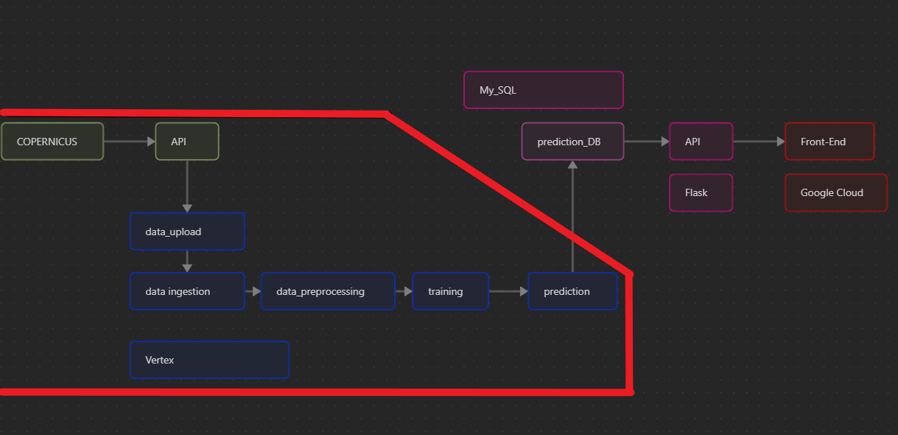
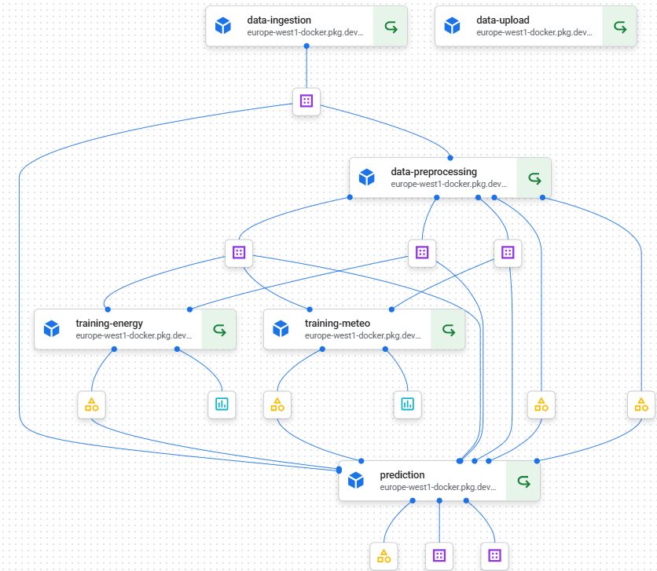
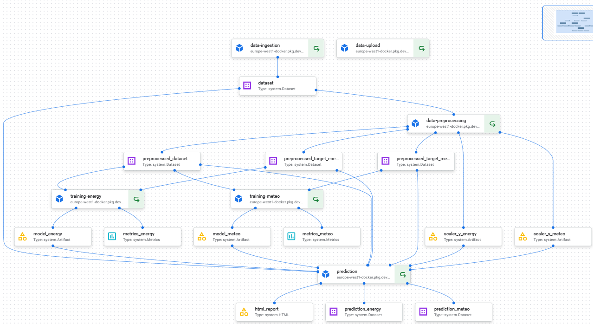

# Wattwise MLOps Project

A full-stack MLOps solution to forecast energy consumption and weather-related variables across European countries using machine learning. This project integrates automated model training and deployment using Google Cloud Platform. This was developped using a GitFlow approach.

**/!\\** This project has been made in collaboration with Merlin Michel, the complete project is [there](https://github.com/merlinmichel/wattwise-mlops-project), this is just to keep separate my work on the ML pipeline using Vertex AI


<p align="center">
    
</p>

## Work

### 1. DATA RETRIEVAL

Download dataset from [Copernicus](https://cds.climate.copernicus.eu/datasets/sis-energy-derived-reanalysis?tab=overview) API each $15^{th}$ of the month. Then, it is compared with previous dataset on the bucket, if it has been updated, the ML pipeline is triggered, otherwise the model is up to date and the pipeline is stopped.

### 2. ML PIPELINE

Implementation of the machine learning pipeline that runs on Google Cloud Vertex AI, covering data ingestion, preprocessing, training, and prediction.


- Ingests energy and meteorological data from `data-upload`
- Preprocesses & scales features
- Trains two separate models:
  - `training_energy.py`: Forecasting energy-related variables
  - `training_meteo.py`: Forecasting meteorological features
- Predicts values and pushes them to Bigtable
- Runs containerized via Docker on Vertex AI Pipelines

<p align="center">
    
</p>


### 3. CI/CD

- pre-commit-hooks to check quality of code using Ruff
- Test some functionality of code using Pytest
- Continuous deployement on Google cloud command using python (not finished)

## Directory Structure

```
wattwise-mlops-project/
│
├── .github/workflows/          # CI/CD
├── data/                       # Local CSV files (optional dev use)
├── notebooks/                  # Exploratory notebooks (optional)
├── tests/                      # Unit tests
│
├── vertex_pipeline/            # Vertex AI ML training pipeline
│   └── README.md
│
├── web_application/            # Streamlit frontend and Docker setup
│   └── README.md
│
├── .pre-commit-config.yaml     # check/format quality and continuity of code
├── README.md                   # ← You are here
└── requirements.txt            # Root dependencies
```

## Project Overview

- **Machine Learning Pipeline**: Built on **Vertex AI**, it automates data ingestion, preprocessing, model training, and prediction.
- **Web Application**: Built with **Streamlit**, deployed with **Cloud Run**, it visualizes forecasts and allows user interaction.
- **Cloud Native**: Data is stored in **Google Bigtable**, and infrastructure is orchestrated through **Docker** and **gcloud**.

## Cloud Services Used

| Component         | GCP Service        |
|------------------|--------------------|
| ML Pipelines      | Vertex AI          |
| Model Serving     | Cloud Run          |
| Containerization  | Cloud Build + Docker |
| Storage           | Google Bigtable    |
| Auth              | IAM + Service Accounts |

